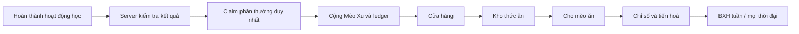

# Mèo Đồng Hành — đặc tả và kế hoạch kỹ thuật

## 1. Mục tiêu

`Mèo Đồng Hành` là hệ thống thú cưng dành cho EnglishGo. Người học hoàn thành
hoạt động học đã được máy chủ xác thực để nhận **Mèo Xu**, dùng Xu mua thức ăn,
nuôi mèo và tích luỹ **Điểm chăm sóc** để tiến hoá. Tính năng biến tiến độ học
thành một vòng phản hồi tích cực, không phải một hình phạt khi người dùng bận.

Tính năng bao gồm:

- mèo hoạt hình có chiều sâu/3D nổi ở góc giao diện;
- ví Mèo Xu, cửa hàng, kho thức ăn và thao tác cho ăn;
- chỉ số no bụng, vui vẻ, trạng thái và năm cấp tiến hoá;
- thưởng Xu từ các luồng học thật của ứng dụng;
- bảng xếp hạng chăm mèo theo tuần và mọi thời đại;
- quyền riêng tư, chống cộng điểm hai lần và chống sửa số dư ở phía client.

Không đưa vào MVP: nhiều loài thú, chat/trao đổi giữa người dùng, gacha, vật
phẩm mua bằng tiền thật, thông báo đẩy hay phạt người không đăng nhập.

## 2. Nguyên tắc sản phẩm

### 2.1 Ba đại lượng không được nhầm lẫn

| Đại lượng | Nguồn | Mục đích | Có thể bị tiêu? |
| --- | --- | --- | --- |
| XP học tập | Hệ `study-activity.ts` hiện có | streak, dashboard, thống kê học | Không |
| Mèo Xu | Hoạt động học được xác thực | mua thức ăn | Có |
| Điểm chăm sóc | Mỗi lần cho mèo ăn | tiến hoá và BXH | Không |

Không tái sử dụng `totalStudyXp` làm tiền. Đó là số liệu lịch sử đang hiển thị
trên Hub; việc trừ nó sẽ làm sai thành tích, streak và cảm giác tiến bộ.

### 2.2 Không gây áp lực tiêu cực

- Mèo đói chỉ đổi biểu cảm và nhắc nhẹ; không chết, không mất cấp, không khoá
  bài học và không trừ XP.
- Cấp tiến hoá dựa trên tổng Điểm chăm sóc nên không thể bị tụt.
- Chỉ phát hoạt ảnh đáng chú ý khi vừa cho ăn hoặc tiến hoá. Mèo nổi/nháy mắt
  phải rất nhẹ, có tôn trọng `prefers-reduced-motion`.
- Bài thi và vùng làm bài tập trung không hiển thị thú cưng nổi.

## 3. Hành trình người dùng



1. Người dùng đăng nhập lần đầu nhìn thấy Mực, một mèo con cấp 1, có sẵn 12
   Mèo Xu và một phần Hạt cá để bắt đầu.
2. Khi đáp án/nghiệm thu bài học được server ghi nhận, server tạo một reward
   claim với khoá duy nhất. Client chỉ nhận thông báo số Xu được cộng, không
   gửi số tiền cần cộng.
3. Người dùng mở mèo nổi hoặc đi đến `/pet`, mua thức ăn từ danh mục cố định,
   sau đó cho ăn trong Kho đồ.
4. Cho ăn cập nhật no bụng, vui vẻ, tổng Điểm chăm sóc và snapshot BXH trong
   cùng một Firestore transaction.
5. Khi vượt mốc cấp, giao diện hiển thị chúc mừng một lần và mô hình đổi màu
   aura/phụ kiện.

## 4. Thiết kế trải nghiệm và điều hướng

### 4.1 Mèo nổi toàn cục

- Vị trí: cố định góc phải dưới, cách cạnh 20–24px; tránh vùng safe-area trên
  mobile. Trên màn nhỏ nó thu gọn thành nút tròn có mặt mèo.
- Bấm nút mở popover: tên, cấp, số Xu, no bụng, thanh tới cấp sau và lối tắt
  `Cho ăn` / `Vào nhà Mèo`.
- Hover trên desktop chỉ nâng rất nhẹ; không dựa vào hover trên touch screen.
- Không render tại `/listen/practice`, `/read/practice`, `/practice/session`
  và khi người dùng bật giảm chuyển động.
- Cảnh được tải động ở phía client. Bản dự phòng là SVG/CSS dễ thương, vì vậy
  một GPU yếu hoặc lỗi WebGL không làm hỏng thao tác chăm mèo.

### 4.2 Trang `/pet`

Trang server lấy dashboard qua `getPetDashboard(user.uid)`, sau đó truyền dữ
liệu ban đầu cho client component. Bố cục:

1. Hero: mèo lớn, cấp hiện tại, mood và thanh Điểm chăm sóc.
2. Bốn chỉ số: Mèo Xu, no bụng, vui vẻ, số ngày đã chăm.
3. Tab **Nhà Mèo**, **Cửa hàng**, **Kho đồ**, **Bảng xếp hạng**.
4. Bảng hoạt động gần đây (ledger) và công tắc quyền riêng tư BXH.

Top navigation và menu mobile thêm lối vào `Mèo cưng`; Hub có card tóm tắt
Mèo Xu/cấp và link mở `/pet`.

### 4.3 Trạng thái hình ảnh

| State | Điều kiện | Phản hồi thị giác |
| --- | --- | --- |
| `happy` | no >= 65 và vui >= 65 | mở mắt, đuôi cong, aura nhẹ |
| `content` | trạng thái bình thường | thở/chớp mắt rất chậm |
| `hungry` | no < 35 | ngồi gọn, bubble đồ ăn |
| `sleepy` | vui < 35 | mắt khép, `Zzz` |
| `eating` | lệnh cho ăn thành công | hoạt ảnh một lần, tối đa 1.4s |
| `evolving` | mốc cấp vừa qua | chúc mừng toàn màn hình, hiếm |

## 5. Kinh tế game của MVP

### 5.1 Nguồn Mèo Xu

| Sự kiện xác thực | Xu | Khoá idempotent |
| --- | ---: | --- |
| Câu nghe/đọc đúng lần đầu | 3 | `skill:{module}:{questionId}` |
| Ôn một từ vựng | 2 | `vocab:review:{wordId}:{ngày}` |
| Thành thạo từ mới | 5 | `vocab:mastered:{wordId}` |
| Hoàn thành game từ vựng | 10 | `vocab:game:{historyId}` |
| Hoàn thành dictation segment | 4 | `dictation:{lessonId}:{segmentId}` |
| Nộp bài thi | 20 / 25 | `practice:{attemptId}` |

Trần mặc định là 60 Xu/ngày (múi giờ `Asia/Ho_Chi_Minh`). Reward bị trần vẫn
ghi claim để không thể gọi lại sau. Số tiền và catalog đều là hằng số phía
server, không nhận từ request client.

### 5.2 Danh mục thức ăn

| Id | Giá | No bụng | Vui vẻ | Điểm chăm sóc |
| --- | ---: | ---: | ---: | ---: |
| `KIBBLE` — Hạt cá | 5 | +12 | +4 | +5 |
| `SALMON` — Cá nướng | 12 | +28 | +9 | +12 |
| `PATE` — Pate đặc biệt | 20 | +45 | +16 | +20 |
| `CAKE` — Bánh sinh nhật | 50 | +90 | +28 | +55 |

No bụng và vui vẻ luôn bị giới hạn trong `[0, 100]`. Mỗi bốn giờ không tương
tác, no bụng giảm 1; mỗi tám giờ, vui vẻ giảm 1. Khi đọc dashboard tính giá trị
hiện thời từ `lastStatusAtMillis`; chỉ ghi lại khi một action thay đổi pet.

### 5.3 Tiến hoá

| Cấp | Tên | Tổng Điểm chăm sóc cần có | Nâng cấp hình ảnh |
| ---: | --- | ---: | --- |
| 1 | Mèo Con | 0 | màu lông cơ bản |
| 2 | Mèo Nghịch Ngợm | 150 | tai/đuôi sinh động hơn |
| 3 | Mèo Thám Hiểm | 500 | khăn quàng hoặc balo |
| 4 | Hộ Vệ Học Tập | 1.200 | aura vàng nhạt |
| 5 | Mèo Thiên Tài | 2.500 | aura hiếm, huy hiệu |

Mốc là cấu hình mã nguồn trong MVP để đảm bảo atomicity và dễ test. Khi cần
admin tinh chỉnh, đưa chúng vào collection chỉ-admin sau khi đã có màn quản trị
và quy trình migrate.

## 6. Kiến trúc dữ liệu Firestore

Tất cả path thuộc về Firebase Authentication UID.

```text
users/{uid}/pet/profile
  name, evolutionStage, careXpTotal, fullness, happiness,
  lastStatusAtMillis, totalFeedings, rankOptIn, createdAtMillis

users/{uid}/pet/wallet
  balance, lifetimeEarned, lifetimeSpent, updatedAtMillis

users/{uid}/pet/inventory/items/{foodId}
  foodId, quantity, updatedAtMillis

users/{uid}/pet/rewardClaims/items/{sourceKey}
  sourceKey, amount, type, occurredAtMillis, dateKey

users/{uid}/pet/rewardDays/items/{YYYY-MM-DD}
  earned, updatedAtMillis

users/{uid}/pet/ledger/entries/{entryId}
  type, amount, foodId, title, occurredAtMillis, balanceAfter

petLeaderboards/{weekly_YYYY-Www|all_time}/entries/{uid}
  uid, petName, displayName, avatarUrl, evolutionStage,
  score, careXpTotal, totalFeedings, updatedAtMillis
```

`rewardClaims` và `ledger` là audit trail. Không xoá hoặc sửa ở client. Với
quy mô lớn có thể TTL ledger cũ và giữ aggregate, nhưng MVP không cần.

## 7. Dịch vụ và API

File chính: `web/src/lib/services/pet.ts`. Module này chỉ được nhập từ server
components/API/services; Firebase Admin trong module bảo đảm nó không được đưa
vào client bundle.

| Hàm | Trách nhiệm |
| --- | --- |
| `getPetDashboard(uid)` | provision lần đầu, tính decay, đọc wallet/kho/ledger |
| `grantPetCoins(input)` | claim một nguồn duy nhất, áp trần ngày, cộng ví/ledger |
| `buyPetFood(uid, foodId)` | kiểm tiền, trừ ví, cộng kho trong transaction |
| `feedPet(uid, foodId)` | kiểm kho, tính status, cộng care XP và BXH atomically |
| `updatePetProfile(uid, input)` | đổi tên và bật/tắt opt-in BXH |
| `getPetLeaderboard(scope)` | lấy snapshot công khai và đánh hạng ổn định |

Route handlers:

| HTTP | Route | Auth | Chức năng |
| --- | --- | --- | --- |
| GET | `/api/pet` | bắt buộc | dashboard mới nhất |
| POST | `/api/pet/shop/buy` | bắt buộc | body `{ foodId }` |
| POST | `/api/pet/feed` | bắt buộc | body `{ foodId }` |
| PATCH | `/api/pet/profile` | bắt buộc | body `{ name?, rankOptIn? }` |
| GET | `/api/pet/leaderboard?scope=weekly|all-time` | không | bảng công khai |

Mỗi route dùng `requireUser`, `parseBody` và `withErrorHandling` như các API
hiện tại. Response luôn theo envelope `{ success, data, error }`.

## 8. Luồng code tích hợp thưởng học tập

### 8.1 Nguyên tắc

Không tạo API `/claim-reward` công khai để client tự gọi. Thay vào đó, gọi
`grantPetCoins()` trong cùng dịch vụ server nơi kết quả đã được xác thực.
Lỗi pet bị catch sau khi nghiệp vụ học chính thành công để thú cưng không làm
người học mất kết quả; ledger idempotent bảo đảm retry an toàn.

### 8.2 Điểm tích hợp hiện tại

- `learning-tool-service.ts`: sau khi ghi câu trả lời đúng, thưởng câu
  listening/reading lần đầu.
- `vocab.ts`: sau `vocab_review`, `vocab_mastered` và ghi `vocabStudyHistory`.
- `dictation.ts`: sau khi segment được đánh dấu hoàn thành.
- `practice.ts`: sau khi attempt được lưu và điểm có hiệu lực.

Mỗi call truyền UID, source key, amount, title và `occurredAtMillis`. Phần
thưởng duplicate trả `granted: 0` chứ không throw.

## 9. Bảo mật, riêng tư và chống gian lận

1. Firestore rules chỉ cho owner đọc các subcollection pet; **không** cho client
   write `pet`, `rewardClaims`, `wallet`, `inventory`, `ledger` hoặc leaderboard.
2. Mọi thay đổi số dư chạy qua Firebase Admin transaction. Transaction đọc tất
   cả document phụ thuộc trước khi write để hai tab không tạo số dư âm.
3. `sourceKey` được encode và dùng làm document id claim. Một câu hỏi/bài nộp
   chỉ có thể thưởng một lần.
4. Giá thức ăn lấy từ `PET_FOOD_CATALOG` server-side. Request chỉ có `foodId`
   union enum Zod.
5. BXH chỉ chứa nickname, tên mèo, avatar đã công khai và số liệu aggregate;
   không lưu email. `rankOptIn` mặc định `false`.
6. API giới hạn bằng existing rate-limit khi traffic lớn; reward cap ngày giảm
   thêm động cơ spam.

## 10. UI implementation detail

- `PetFloatingWidget.tsx` là client component đặt trong `AppShell`.
- `PetCat.tsx` tạo mèo bằng CSS 3D/HTML (`transform-style: preserve-3d`), không
  tải model/texture bên ngoài. Vì vậy màn đầu không tăng bundle nặng và vẫn có
  chiều sâu, shadow, parallax nhẹ và animation state-based.
- `PetDashboardClient.tsx` giữ state optimistic chỉ sau response thành công;
  button disable trong lúc request; khi thất bại hiển thị lỗi, không trừ UI.
- Popover/section dùng semantic `<button>`, `aria-live` cho reward, label rõ
  ràng cho thanh chỉ số; tất cả tab và action hoạt động bằng bàn phím.
- Chỉ animation `transform`, `opacity`; enter ở `scale(0.96)` thay vì `scale(0)`;
  duration UI 160–220ms với custom ease-out.

## 11. Firestore rules bổ sung

Trong matcher `/users/{uid}`, thêm matcher cụ thể `pet/{docId}` và subcollections
với `allow read: if isOwner(uid); allow write: if false;`. Không để rule wildcard
hiện tại cho phép direct write pet. Thêm matcher public read-only:

```text
petLeaderboards/{boardId}/entries/{uid}: read true, write false
```

Admin SDK bỏ qua Firestore rules, nên API server tiếp tục thực hiện transaction
đúng quyền.

## 12. Kiểm thử bắt buộc

### Unit

- `evolutionForCareXp`: tất cả ranh giới 0, 149, 150, 499, 500, 1200, 2500.
- `derivePetStatus`: clamp 0–100, decay đúng theo thời gian và mood hợp lệ.
- Catalog không có giá âm/care XP âm; `foodId` không hợp lệ bị từ chối.
- `currentPetWeekKey` nhất quán theo `Asia/Ho_Chi_Minh`.

### Integration/service

- cùng `sourceKey` gọi hai lần chỉ có một reward/ledger.
- cap ngày không làm balance vượt giới hạn.
- mua khi thiếu Xu bị từ chối; hai request mua đồng thời không âm số dư.
- cho ăn khi không có item bị từ chối; cho ăn cập nhật kho, profile và BXH.
- opt-out xoá snapshot BXH công khai.

### UI/E2E/manual

- trang `/pet` responsive 320px, desktop, dark/light theme;
- keyboard: mở widget, tab, mua, cho ăn;
- `prefers-reduced-motion`; tab background; lỗi mạng;
- không xuất hiện widget trong route làm bài tập trung;
- SSR/build không import server service vào component client.

## 13. Triển khai và vận hành

1. Deploy source + Firestore rules cùng release.
2. Không backfill Xu theo lịch sử để tránh phát hành tiền hàng loạt không công
   bằng. Profile đầu có starter pack rõ ràng.
3. Theo dõi: số reward, tỷ lệ mua/cho ăn, mức chạm cap, số người opt-in BXH,
   lỗi transaction và Core Web Vitals khi widget hiện diện.
4. Sau 7–14 ngày beta, điều chỉnh reward/catalog/mốc cấp dựa vào median Xu/ngày
   thay vì trực giác; mọi thay đổi balance phải được ghi changelog.

## 14. Tiêu chí hoàn thành MVP

- Người dùng đăng nhập có thể xem, đổi tên và nuôi một con mèo.
- Hoạt động học hợp lệ cộng Xu một lần và không làm sai XP hiện có.
- Mua/cho ăn bền vững qua reload, refresh, đa tab; không âm tiền/kho.
- Mèo có phản hồi trạng thái, tiến hoá đúng năm mốc và fallback khi giảm motion.
- BXH tuần/tổng không lộ email và yêu cầu opt-in.
- Typecheck, lint, unit test và production build xanh; rules được cập nhật.

## 15. Bổ sung: pet sưu tầm và quyền hiển thị

Bản mở rộng này thay thế giới hạn "một con mèo" ở MVP:

- Asset chính là minh hoạ mèo 3D nền trong suốt tại
  `web/public/pets/muc-cat.png`; `PetCat.tsx` dùng asset này thay cho mô hình
  CSS robot cũ. Ba biến thể màu giúp các pet vẫn phân biệt rõ ở hero, tủ pet
  và widget nổi.
- Catalog server-side `PET_COMPANION_CATALOG` gồm `MUC` (starter), `MOCHI`
  (350 Mèo Xu) và `LUNA` (900 Mèo Xu). Giá được tính trong Firebase Admin
  transaction, không nhận từ client. Mua pet tự động trang bị và ghi ledger.
- Quyền sở hữu lưu ở `users/{uid}/pet/companions/items/{companionId}`;
  profile có thêm `equippedCompanionId` và `floatingEnabled`. Chỉ pet đã sở
  hữu mới có thể được trang bị.
- Công tắc **Hiện pet nổi trên các trang** ở tab Nhà Mèo được lưu theo tài
  khoản. Khi tắt, widget biến mất ở toàn bộ app; khi bật lại, widget tải lại
  ngay bằng event client nội bộ. Người học luôn có thể quay lại `/pet` từ
  header để bật lại.
- API mới: `POST /api/pet/companions/buy` với body `{ companionId }`; PATCH
  `/api/pet/profile` nhận thêm `{ floatingEnabled?, equippedCompanionId? }`.
