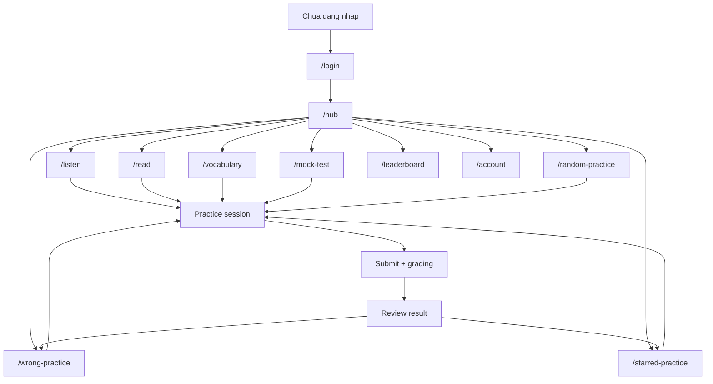
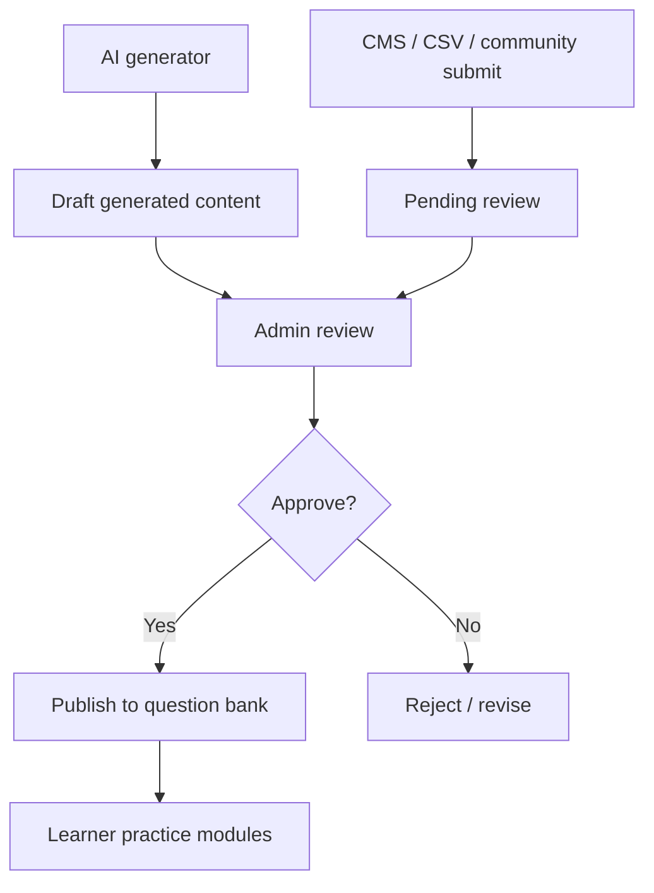

# Workflow & Product Plan - EnglishWebApp Dautoeic-style Free Clone

## 1. Dinh huong san pham

EnglishWebApp se chuyen tu app luyen de co ban sang nen tang hoc TOEIC theo module, bam sat luong hoc va trai nghiem chuc nang cua `dautoeic.com` nhat co the trong stack hien tai.

Muc tieu chinh:

- Hub hoc tap trung tam cho nguoi hoc.
- Skill hubs: Listening, Reading, Grammar, Vocabulary, Mock Test.
- Practice engine dung chung cho test, part practice, random, starred, wrong answers.
- Review loop ro rang: lam bai -> cham -> xem giai thich -> luyen lai cau sai/cau danh dau.
- Account/progress/leaderboard de tao cam giac san pham hoc tap hoan chinh.
- Admin CMS du de tu tao noi dung theo module.
- Content pipeline ket hop 2 nguon: AI generate cau hoi TOEIC-style va CMS/community tu nhap/import, tat ca phai qua buoc review truoc khi publish.
- Tat ca tinh nang hoc deu FREE cho nguoi hoc. Khong co Premium, paywall, upgrade, checkout hay upsell.

Rang buoc quan trong: khong copy logo, asset, cau hoi, text marketing, source code hay noi dung co ban quyen cua Dautoeic. Ta clone cau truc san pham, flow va hanh vi chuc nang; noi dung va visual asset phai tu tao.

## 2. Kien truc giu lai

Repo hien tai dang dung:

- Java 17, Spring Boot 3, Maven.
- MySQL + Flyway.
- Firebase Authentication cho dang nhap; MySQL luu user/role/business data.
- Thymeleaf server-rendered pages.
- Alpine.js/vanilla JS cho tuong tac tren trang.

Huong di: tiep tuc stack nay. Khong rewrite React/Vite trong giai doan nay, vi muc tieu la co san pham chay duoc nhanh va tan dung code hien co.

## 3. Chinh sach Free-first

Ung dung nay phuc vu muc dich hoc ca nhan, nen:

- Moi learner dang nhap deu truy cap duoc toan bo bai hoc, practice, vocabulary, mock test, wrong/starred/random practice.
- Khong co logic khoa tinh nang theo goi.
- Cac entity `subscriptions` va `transactions` hien co chi la legacy/demo; khong dung lam dieu kien truy cap.
- Cac route cu lien quan billing nen redirect ve `/hub` hoac hien thong bao "all learning features are free".
- Admin dashboard khong hien revenue/sales/payment lam KPI chinh.

## 4. Luong nguoi hoc muc tieu

## 5. Luong practice engine

Mot practice engine dung chung se giam lap code:

1. User chon nguon bai: mock test, part practice, random, starred, wrong, vocabulary, grammar.
2. Backend tao session co danh sach question IDs, mode, time limit, source type.
3. Frontend render mot giao dien lam bai chung: timer, audio/passage, navigator, answer controls, star/report.
4. Autosave vao draft/session state.
5. Submit goi grading service.
6. Backend tao attempt/result, tinh score, per-part stats, wrong answer queue.
7. Review page hien overview, cau sai, explanation/transcript, CTA luyen lai.

## 6. Luong tao noi dung

App se co 2 nguon noi dung song song:

### 6.1. AI generate TOEIC-style

1. Admin chon skill/part/difficulty/topic/so cau.
2. Backend goi AI provider de tao passage/audio script/question/options/correct answer/explanation.
3. Ket qua luu vao `content_generation_jobs` va `generated_questions` o trang thai `DRAFT`.
4. Admin review tung cau: sua noi dung, dap an, giai thich, tag, audio script.
5. Chi khi admin bam `Publish`, cau hoi moi vao bank chinh (`questions`, `answer_options`, `accepted_answers`, `question_groups`).
6. Moi noi dung AI phai co metadata `source_type=AI_GENERATED`, `reviewed_by`, `reviewed_at`.

Quy tac prompt:

- Tao cau hoi theo format TOEIC-style, khong yeu cau AI tai tao de that, khong dua van ban/cau hoi copy tu web khac vao prompt.
- Prompt phai yeu cau output JSON co schema ro rang.
- Backend validate JSON, dap an dung, so option, part, difficulty truoc khi luu.

### 6.2. CMS/community tu nhap/import

1. Teacher/admin/contributor tao bo cau hoi bang form CMS hoac upload CSV/Excel.
2. Import service parse file, hien preview, bao loi theo dong.
3. Noi dung nguoi dung nhap vao `content_submissions` trang thai `PENDING_REVIEW`.
4. Admin review, sua, approve/reject.
5. Approved content duoc publish vao bank chinh va ghi attribution/nguon.

Quy tac nguon:

- Chi nhap noi dung tu nguon user co quyen dung, tu tao, public-domain/open-license, hoac duoc phep.
- Khong import de/cau hoi/audio tu Dautoeic, Study4, sach de thi, PDF thuong mai neu khong co quyen.

## 7. Module va route chuan hoa

| Module | Route moi | Route cu/hien co | Viec can lam |
| --- | --- | --- | --- |
| Hub | `/hub` | `/` dashboard | Redirect sau login ve `/hub`; `/` co the redirect theo auth |
| Login | `/login` | `/login` | Giu, polish UI |
| Account | `/account` | chua co | Tao profile settings |
| Listening | `/listen` | `/tests`, `/tests/{id}/practice` | Hub part 1-4 + practice source |
| Reading | `/read` | `/tests`, `/lessons` | Hub part 5-7 + grammar/read tabs |
| Grammar | `/grammar` | `/lessons` | Tach topic/subtopic/practice |
| Vocabulary | `/vocabulary` | `/vocab` | Route moi, `/vocab` redirect |
| Mock Test | `/mock-test` | `/tests` | Chuan hoa test type va UI roadmap |
| Random | `/random-practice` | chua co | Session tu cau random |
| Starred | `/starred-practice` | chua co | User-starred questions |
| Wrong | `/wrong-practice` | chua co | Queue cau sai |
| Review | `/attempts/{id}/review` | da co | Nang cap UI/stats |
| Leaderboard | `/leaderboard` | `/community` | Tach route rieng |
| Billing legacy | `/billing` | `/billing` | Redirect ve `/hub` hoac thong bao app free |
| Admin | `/admin/*` | `/teacher/cms` | Tach admin CMS theo module |
| AI generator | `/admin/generate` | chua co | Tao draft TOEIC-style questions bang AI |
| Content review | `/admin/content-review` | chua co | Duyet AI/community/import content truoc khi publish |
| Community submit | `/contribute` | chua co | Learner/teacher gui cau hoi de admin duyet |

## 8. Database huong moi

Giu cac bang hien co, bo sung theo nhu cau:

- `practice_sessions`: source type, source id, user id, mode, question ids JSON, started/submitted, time limit.
- `user_starred_questions`: user id, question id, created at.
- `wrong_answer_reviews`: user id, question id, last_wrong_at, review_count, mastered_at.
- `question_tags` / `tags`: topic, grammar point, skill, difficulty.
- `daily_goal_logs`: user id, date, target, completed count.
- `media_assets`: optional cho upload/audio/image sau nay.
- `content_generation_jobs`: prompt params, provider, status, raw response, created_by, created_at.
- `generated_questions`: job id, draft JSON, validation status, review status.
- `content_submissions`: submitted_by, source_type, source_note, payload JSON, status, reviewed_by, reviewed_at.
- `content_audit_logs`: entity type/id, action, actor, before/after JSON.

Khong them `plans`, `premium_features`, `entitlements` cho learner features. Moi thay doi schema phai la Flyway migration moi. Khong sua migration cu da chay.

## 9. Definition of Done cho moi task

Moi task trong `task.md` chi duoc xem la xong khi:

- Co route hoac UI thay duoc tren browser.
- Co backend controller/service/repository hoac query that.
- Co data that tu database hoac seed ro rang.
- Co validation/error/empty state toi thieu.
- Khong khoa tinh nang hoc sau paywall.
- Content moi tu AI/community/import phai o trang thai draft/pending truoc khi admin approve.
- Co test cho logic nghiep vu neu task co cham diem, SRS, session.
- `mvn test` pass.
- README/task docs cap nhat neu workflow chay app thay doi.

## 10. Thu tu uu tien

1. Fix nen tang va UI shell.
2. Hub + account + leaderboard.
3. Listen/Read/Grammar hubs.
4. Practice engine chung.
5. Wrong/starred/random loops.
6. Vocabulary route va review queue.
7. Mock test roadmap.
8. Free access cleanup cho billing/subscription legacy.
9. Admin CMS theo module.
10. AI generator + content review pipeline.
11. Community submit/import pipeline.
12. PWA polish va test coverage.

## 11. Nguyen tac UI

- Giao dien nen la learning dashboard hien dai, gon, nhieu tin hieu tien do.
- Dung route/module card thay vi trang danh sach don dieu.
- Mobile-first; learner hay hoc tren dien thoai.
- Khong lam landing marketing dai truoc khi co app that. First screen sau login la hub hoc.
- Tat ca button/task quan trong phai co trang thai loading/disabled/error.
- Khong copy logo, anh, font asset, text marketing, cau hoi hay source cua Dautoeic.
- Co the bam sat spacing, nhom chuc nang, luong dieu huong va hanh vi UX o muc san pham.
